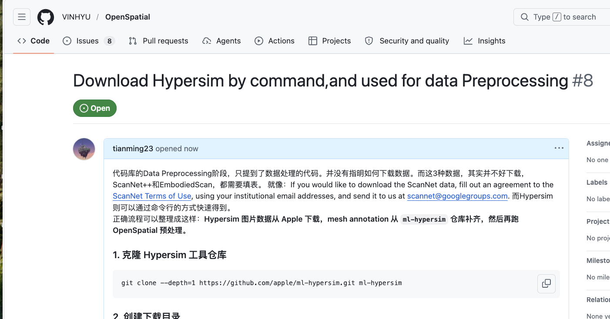

## 简介
我是黄浩，现在是北京大学硕士生，受文再文老师指导。目前的研究兴趣为计算机视觉（世界模型，多模态），目前还没有发表，从事过的工作范围比较杂，但在未来的几年里，已明确我提到的两个方向去发展。虽然我的专业没有一个写着计算机科学，但其实一直都是keep relevant。

## 教育经历 
- 2021-2025：天津大学，信息管理与信息系统
- 2025-至今： 北京大学，机械/先进制造与机器人方向，硕士

## 实习经历
- 2026.03- 至今 智元机器人
完成 Diffusion Policy（ResNet / DINO backbone）及 Pi0.5 在真实 Franka 机械臂上的部署；面向不同任务完成数据采集、模型训练与效果验证，沉淀了遥操作，键盘操作代码、部署控制代码等实验基础设施，并获得了各任务的初步 baseline。围绕后续实验要求，系统调研视频生成与视角转换方向相关工作，基于neoverse论文，完成从头视角到手部视角转换 demo 的初步搭建，主要将 VGGT、WorldMirror、WAN 等方法进行组合，为后续实验推进提供技术基础。

## 优势
- 具备较强的论文复现与工程落地能力，能够阅读并理解已有项目代码，完成环境配置、数据准备、训练/推理流程打通，并复现已有项目的完整 pipeline。
  - 针对京东最新的工作中的JoyAI-Image中的数据部分的OpenSpatial中存在的不足之处，提出补充材料
  
  - 在真机中部署过duffison policy，pi0.5。真机实验贯穿环境配置、数据准备、训练/推理，每一步都需要仔细check。
-  数学基础好，能很快的培养对于专业领域的数据敏感度，理解能力强
-  熟悉Linux开发，部分集群使用规则
-  debug能力较好，会独立自主的去解决很显示的问题

